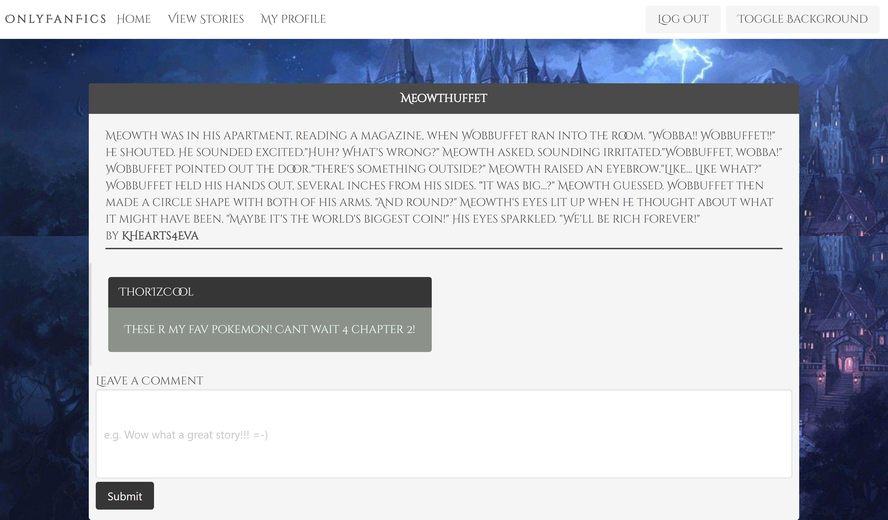

# Project-2-FanFic

## Application Link

https://mysterious-lowlands-06062.herokuapp.com/

## User Story

```md
<As A> fanfiction writer
<I Want> a place to showcase my work
<So that> I can receive feedback from fellow writers
```

## Pages

Log In Page


Sign Up Page


Profile Page


Write Story Page


All Story View Page


Single story


## Technologies Used

```md
HTML, CSS, Javascript, Express.js, mySQL, sequelize, node.js, bcrypt, handlebars
```

## Functionality

```md
This app allows users to securely create a profile with a username email and password, write stories to the database, write comments to individual stories, and view all of their written stories.
```

## Structure

```md
We used MVC structure to organize this site. We created models for user, story, and comments. We also used handlebars as a template to render the front end, and partials to dynamically generate story cards. We use get and post routes to render pages and put information to the database.
```

## Models

User Model contains id, user_name, email, and password

```javascript
class User extends Model {
  checkPassword(loginPw) {
    return bcrypt.compareSync(loginPw, this.password);
  }
}
// defining columns for user table
User.init(
  {
    id: {
      type: DataTypes.INTEGER,
      allowNull: false,
      primaryKey: true,
      autoIncrement: true,
    },
    user_name: {
      type: DataTypes.STRING,
      allowNull: false,
    },
    email: {
      type: DataTypes.STRING,
      allowNull: false,
      unique: true,
      validate: {
        isEmail: true,
      },
    },
    password: {
      type: DataTypes.STRING,
      allowNull: false,
      validate: {
        len: [8, 12],
      },
    },
  },
  // adding hooks so that input passwords are hashed before being sent to database
  {
    hooks: {
      beforeCreate: async (newUserData) => {
        newUserData.password = await bcrypt.hash(newUserData.password, 10);
        return newUserData;
      },
      beforeUpdate: async (updatedUserData) => {
        updatedUserData.password = await bcrypt.hash(
          updatedUserData.password,
          10
        );
        return updatedUserData;
      },
    },
    sequelize,
    timestamps: false,
    freezeTableName: true,
    underscored: true,
    modelName: "user",
  }
);
// export for index
module.exports = User;
```

Comment model contains id, body, and story_id and user_id as foreign keys
Comments must relate to both story and users

```javascript
Comment.init(
  {
    id: {
      type: DataTypes.INTEGER,
      allowNull: false,
      primaryKey: true,
      autoIncrement: true,
    },
    comment_body: {
      type: DataTypes.STRING(1000),
      allowNull: false,
    },
    story_id: {
      type: DataTypes.INTEGER,
      references: {
        model: "story",
        key: "id",
      },
    },
    user_id: {
      type: DataTypes.INTEGER,
      references: {
        model: "user",
        key: "id",
      },
    },
  },
  {
    sequelize,
    timestamps: false,
    freezeTableName: true,
    underscored: true,
    modelName: "comment",
  }
);
// export for index
module.exports = Comment;
```

Story model contains id, title, summary, story_content, user_id

```javascript
Story.init(
  {
    id: {
      type: DataTypes.INTEGER,
      allowNull: false,
      primaryKey: true,
      autoIncrement: true,
    },
    title: {
      type: DataTypes.STRING,
      allowNull: false,
    },
    summary: {
      type: DataTypes.STRING(1000),
    },
    story_content: {
      type: DataTypes.TEXT("long"),
    },
    user_id: {
      type: DataTypes.INTEGER,
      references: {
        model: "user",
        key: "id",
      },
    },
  },
  {
    sequelize,
    timestamps: false,
    freezeTableName: true,
    underscored: true,
    modelName: "story",
  }
);
// exporting for index
module.exports = Story;
```
